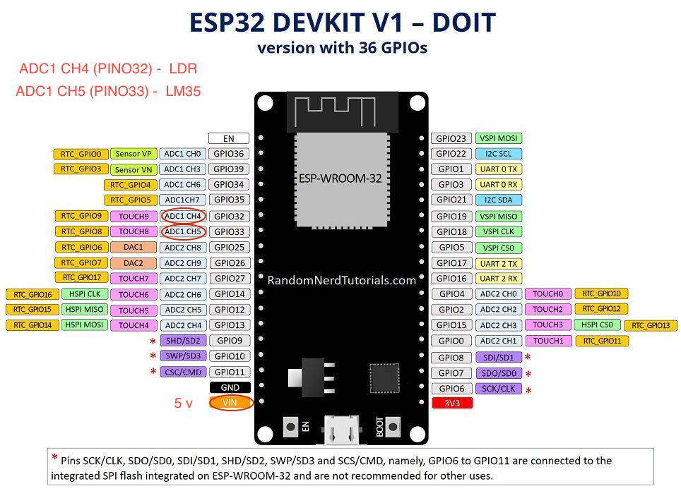

# Monitoramento na IoT
## Atividade da Disciplina de Sistemas Operacionais II

- **Embarcado utilizado:** [ESP32](https://pt.wikipedia.org/wiki/ESP32)
- **Linguagem de Programação:** [MicroPython](https://micropython.org/)
- **Ambiente de Desenvolvimento:** [uPyCraft](http://docs.dfrobot.com/upycraft/)
- **Plataforma de Nuvem na IoT utilizada:** [GroveStreams](https://grovestreams.com)
- **Tutoriais utilizados:**
  - [MicroPython na ESP32](https://randomnerdtutorials.com/getting-started-micropython-esp32-esp8266/)
  - [Upload MicroPython Firmware to ESP32](https://randomnerdtutorials.com/flash-upload-micropython-firmware-esp32-esp8266/)
  - [GroveStreams](https://grovestreams.com/developers/tutorial_temp.html)
  
### Resumo das Funcionalidades:

  - **Funcionalidades no embarcado**
    - A esp32, neste projeto, tem a função de ler os valores de dois sensores, um LDR (luminosidade) e um LM35 (temperatura).
  
  - **Funcionalidades na Plataforma de Nuvem na IoT**
    - Nossa plataforma receberá dados enviados por nossa ESP32 e nos fornecerá gráficos com as variações sofridas pelos nossos sensores.

### Projeto
   Abaixo está listado os materias necessários para a execução desse projeto.
   
  - **Materiais**
   
    - Softwares:
      - Cloud IoT: GroveStreams
      - IDE: uPyCraft

    - Hardware:
      - Esp32
      - LDR (sensor de luminosidade)
      - LM35 (sensor de temperatura)
      - Protoboard
      - Cabo de alimentação
      - Resistor de 3,3K
      - fios jumper (usei 4 fios)
  
 ### uPyCraft 
   
  O IDE é um software criado especialmente para a linguagem micropython. Ele é considerado hoje um dos melhores IDEs para se trabalhar com micropython por ser intuitivo e simples de usar.

  #### Instalação

  Abaixo estão os links para os tutorias de instalação do uPyCraft nos 3 principais sistemas operacionais, escolha o seu e mãos na massa.

  - [uPyCraft no Windows](https://randomnerdtutorials.com/install-upycraft-ide-windows-pc-instructions/)
  - [uPyCraft no Linux](https://randomnerdtutorials.com/install-upycraft-ide-linux-ubuntu-instructions/)
  - [uPyCraft no mac](https://randomnerdtutorials.com/install-upycraft-ide-mac-os-x-instructions/)

  #### Conhecendo o uPyCraft

   Na imagem abaixo podemos ter um bom entendimento da IDE.

  

  1. Pasta e arquivos
  2. Editor
  3. Shell / Terminal do MicroPython
  4. Ferramentas

 **1. Pastas e Arquivos**
  - Pasta device (dispositivo)
  
    A pasta device é onde todos os arquivos armazenados na ESP32 devem ser carregados, uma vez que você tenha o embarcado   conectado a IDE via serial.
  Por padrão, você deve ter apenas um arquivo boot.py. Para executar seu código principal crie um arquivo main.py.

   boot.py: é executado quando o dispositivo é iniciado e configura várias opções de configuração;
   main.py: este é o script principal que contém seu código. É executado imediatamente após o boot.py.

 - O uPy_lib guarda os arquivos de bibliotecas.
  
**2. Editor**

A seção Editor é onde você escreve seu código e edita seus arquivos .py. Você pode abrir mais de um arquivo e o Editor abrirá uma nova guia para cada arquivo.

**3. Shell/Terminal MicroPython**

No MicroPython Shell você pode digitar comandos para serem executados imediatamente pela sua placa ESP sem a necessidade de fazer upload de novos arquivos. O terminal também fornece informações sobre o estado de um programa em execução, mostra erros relacionados ao upload, erros de sintaxe, impressões de mensagens, etc.

**4. Ferramentas**

* **Novo arquivo:** cria um novo arquivo no editor;
* **Abrir arquivo:** abra um arquivo do seu computador;
* **Salvar arquivo:** salva um arquivo;
* **Baixe e execute:** carregue o código em sua placa e execute o código;
* **Parar:** interrompa a execução do código. É o mesmo que inserir CRTL + C no Shell para impedir a execução de todos os scripts
* **Conectar / Desconectar:** conecte ou desconecte a sua placa via Serial. Você deve selecionar a porta serial primeiro em Ferramentas> Serial;
* **Desfazer:** desfaz a última alteração no editor de código;
* **Refazer:** refaz a última alteração no editor de código;
* **Verificação de sintaxe:** verifica a sintaxe do seu código;
* **Limpar:** limpa as mensagens da janela Shell / terminal;

#### Firmware

  Ao contrário de outras placas, o MicroPython não é exibido no ESP32. Por isso, é necessário fazermos o upload do firmware para nossa ESP32 conseguir entender a linguagem micropython.

  Vá até o título 'Firmware for ESP32 boards' em [MicroPython downloads](http://micropython.org/downloads) e baixe a última versão do firmware, no momento é o _esp32-20190615-v1.11-45-g14cf91f70.bin_.

#### Conectando o uPyCraft a ESP32 

  Neste momento você deve ter sua ESP32 conectada ao computador pelo cabo de alimentação.

   

**Parte 1**

  Vá em Ferramentas (Tools) > Serial e selecione a porta onde se encontra conectada a sua ESP32 como mostra a numeração 1 na imagem acima.

  Após selecionada você pode clicar no botão _connect_ e verá que o simbolo >>> apareceu no seu terminal. Isto significa que seu estabeleceu coneção com a ESP32.

  _**IMPORTANTE:**_ Caso a porta serial não apareça no seu uPyCraft, pode ser problema no seu cabo USB ou está faltando o drive d. Vá até a sessão chamada [Selecting Serial Port](https://randomnerdtutorials.com/flash-upload-micropython-firmware-esp32-esp8266/) e garanta que sua porta serial está aparecendo antes de continuar esse tutorial.

**Parte 2**

Após completar o passo 1, vá até Ferramentas (Tools) > BurnFirmware e preencha os dados conforme mostrado abaixo.


Selecione todas estas opções para fazer o flash da placa ESP32:

  **board:** esp32
   
  **burn_addr:** 0x1000

  **erase_flash:** yes

  **com:** COMX ou /dev/cu.SLAB_USBtoUART

  **Firmware:** Selecione “Users” e escolha o arquivo .bin da ESP32 que você baixou antes.

Antes de clicar em "ok" pressione o botão **“BOOT / FLASH”** da sua placa ESP32 e mantenha pressionado até o processo “EraseFlash” começar, quando o processo começar você pode soltar o botão flash, como mostra a imagem abaixo. Após alguns segundos, o firmware será mostrado na sua placa ESP32.


**_IMPORTANTE:_** Se a barra "EraseFlash" não se mover e você vir uma mensagem de erro dizendo "Erase false", significa que o seu ESP32 não estava no modo intermitente. Feche sua IDE, abra novamente e repita todos os passos descritos anteriormente e lembre de manter o botão “BOOT / FLASH” precionado novamente para garantir que o seu ESP32 entre em modo intermitente.

### Hardware

#### ESP32

A imagem abaixo nos mostra o esquema das portas da Esp32. 
Como nossos doids sensores a serem lidos possuem respostas analógicas, precisamos conectá-los em uma porta da ESP32 que aceite a leitura de um valor analógico. Podemos usar qualquer uma das portas ADC1 CHx para fazer a leitura dos nossos sensores.
Nesse projeto foi usada a porta ADC1 CH4 (D32) para ler o LDR e ADC1 CH5 (D33) para ler o LM35. Como podemos ver na figura, usaremos a saída de 5V.



### GroveStreams 

 O GroveStrems é uma nuvem IoT, ela te fornece os recursos de tomada de decisão sobre dispositivos conectados a ela, fornece gráficos sobre um dispositivo especifico, ou grupo de dispositivos, em uma hora especifica ou em um intervalo de tempo, etc.
  Para a execução desde projeto é necessário conhecer os conceitos de organization, components e streams.

  - Organização:
    Uma organização é um espaço de trabalho, geralmente representando uma casa, empresa ou organização. Cada organização possui seu próprio conjunto de componentes.
    Qualquer dispositivo que quiser enviar dados para uma organização deverá possuir sua chave privada.

  - Componentes
    Um componente é uma "coisa" que também é um contêiner para um grupo de fluxos e eventos que compartilham um local semelhante.

  - Streams
    Os tipos de dados de fluxo podem ser números, datas e horas, texto, booleanos (sim, não), longitude, latitude ou elevação. Cada stream pode ter filtros de tempo, restrições, métodos de preenchimento de lacunas, uma unidade e outros itens aplicados a seus dados de feed à medida que são enviados.

  **Tutorial:**
  
  1. Crie uma conta no GroveStreams 
  
  2. Crie um organização
  
  3. Crie um componente
  
  **_IMPORTANTE_**: Alguns fusos horários estão com problemas, por isso você deve a colocar o componente em outro fuso America/Montivideu ou Africa (esses funcionaram de primeira para mim). Após sua ESP32 estabelecer conexão pela primeira vez com o GroveStreams, através do primeiro request, você poderá colocar no fuso horário correto. _Caso não funcione, deixe no fuso anterior._
  
  4. Acesse o API keys
 
  
  
  
  
Não se preocupe em criar _streams_, pois quando enviarmos nosso primeiro request (PUT) ao nosso componente ele criará os streams ‘temperature’ e ‘luminosity' automaticamente.


### Código

Nesta ponto você deve ter sua ES32 conectada ao UpyCraft e ter carregado o arquivo firmawre com sucesso.  

Vá na barra lateral do uPyCraft e crie um novo arquivo chamado _main.py_

```python
# é a biblioteca que lida com requests HTTP
import urequests
# usamos ela para estabelecer conexão com a internet
import network 
# ADC lida com os valores analógicos lidos dos sensores e o Pin lida com os pinos do nosso embarcado
from machine import ADC, Pin 
# biblioteca de tempo
import time 
```

Conectando a ESP32 na rede
Como importamos a biblioteca _network_ podemos apenas usar o código abaixo e ela fica responsável por estabelecer nossa conexão.
```python
station = network.WLAN(network.STA_IF)
station.active(True)

station.connect("nomedarede", "senha")
 ```
 
 O código abaixo defini as portas da ESP32 que receberiam a saida dos sensores
 
 ```python
  adc_ldr = ADC(Pin(32))
  adc_temp = ADC(Pin(33))
 ```
Para que o GroveStreams aceite os dados que queremos enviar para ele, devemos enviar a URL no seguinte formato:
_http://grovestreams.com/api/feed?compId=comp1&data1=value&data2=value_, sendo que o valor de compId você vai definir quando for 
Temos alguns dados dessa url que serão sempre iguais em todos os requests, por isso criei variáveis com eles.

```python
  api_key = '&api_key=chave'
  component_id = 'numero_do_id_do_componente'  
  base_url = '/api/feed?'
```
A linha abaixo é usada no cálculo para fazer uma conversão para graus dos valores lidos pelo sensor de temperatura.

```python
  ref = (1.5/4095) / 0.01
```

Ok, agora vamos para o loop que ficará lendo nossos sensores e fazendo a requisição http ao GroveStreams
```python
while True:
    #leitura do LDR
    ldr = str(adc_ldr.read())
    # converti o valor lido do sensor de temperatura para graus celcius
    value = round(adc_temp.read() * ref, 2)
    
    # convertendo o valor da temperatura em string, pois tanto o valor dela quando do LDR precisam ser enviar da url
    temp = str(value)

    path = base_url+'&compId=1'+'&temperature=' + temp + '&luminosity=' + ldr  
    url = 'http://www.grovestreams.com'+path+api_key
  # As linhas abaixo são somente para visualizarmos no nosso shell os valores lidos pelos sensores e a url dinamica montada de   # com esses valores
    print('------------------')
    print('Temperatura: ', temp)
    print('Luminosidade: ', ldr)
    print('------------------')
    print(url)
 # usamos a biblioteca urequests para fazermos a requisição http usando o verbo put e passamos a url
  urequests.put(url) 
 # usamos o método sleep (dormir) da biblioteca time para que tenhamos um intervalo de 30 segundos antes do while iterar novamente
  time.sleep(30) #
```

Quando clicar em DownloadAndRun você verá o resultado no terminal, assim como mostra a imagem abaixo.


Se sua url estiver sendo montada corretamente e o componente do GroveStreams estiver devidamente configurado, se você for até o seu navegor e atualizar seu componente você deverá ver os mesmos valores acima no seu componente.

#### Protoboard


